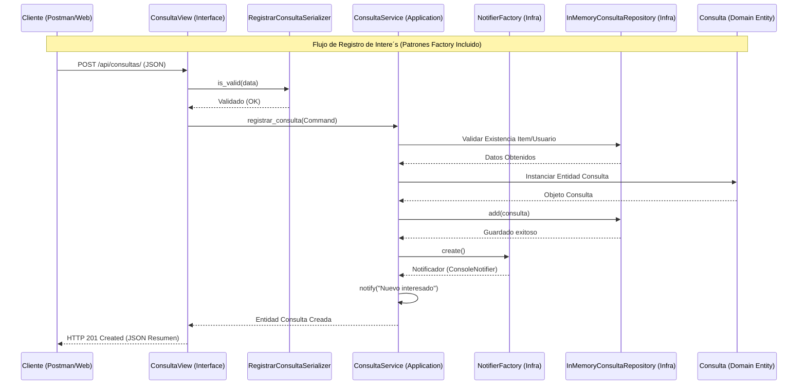

# Diagrama de Secuencia: Registro de Consulta

Este diagrama describe el flujo de interaccio´n entre las capas del sistema (Arquitectura Hexagonal) incorporando patrones creacionales segu´n la ru´brica.

## Justificacio´n de Patrones Creacionales
1. **Factory Method (NotifierFactory)**: Se utiliza para desacoplar la lo´gica de negocio del medio de comunicacio´n (Consola, WhatsApp, Email). Cumple con el requerimiento de gestionar una dependencia externa.
2. **Builder Pattern (ProductoBuilder)**: Aunque no se muestra en este diagrama simple, el sistema utiliza un Builder para la entidad `Producto` (localizado en `builders.py`), garantizando que la creacio´n de la clase ma´s compleja del dominio sea at´omica y validada.

## Estructura de Capas
- **Interface**: `ConsultaView` y `RegistrarConsultaSerializer`.
- **Application**: `ConsultaService` (Orquestador).
- **Domain**: Entidad `Consulta` (Lo´gica pura).
- **Infrastructure**: Repositorios y Notificadores.
