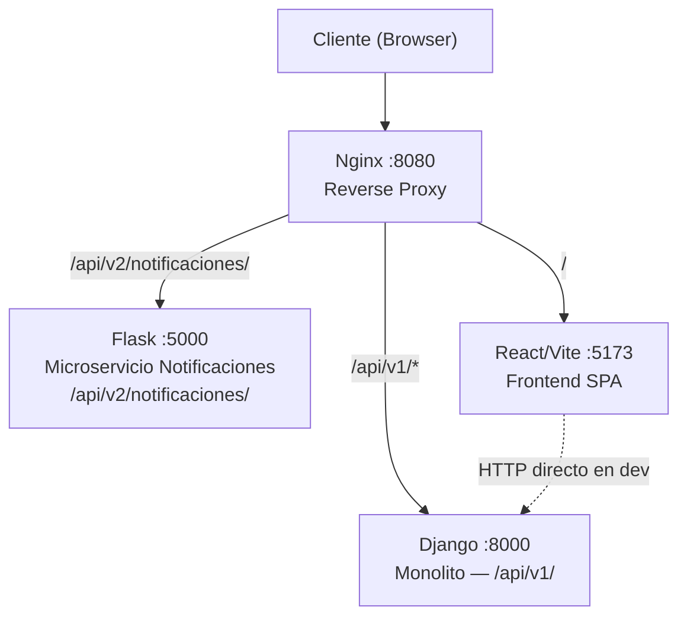

# Documentación Técnica: VecinoMarket

Punto de entrada a la documentación del sistema. VecinoMarket es un marketplace residencial para vecinos, construido sobre **Arquitectura Hexagonal** con una topología de microservicios parcial implementada mediante el **Strangler Pattern**.

## Arquitectura del Sistema

### Servicios

| Servicio | Puerto | Rol |
|---|---|---|
| Nginx | 8080 | Reverse proxy / orquestador de tráfico |
| Django REST | 8000 | Monolito legacy — dominio, publicaciones, consultas |
| Flask | 5000 | Microservicio de notificaciones (Strangler Pattern) |
| React/Vite | 5173 | Single Page Application |

---

## Índice de Documentación

1. **[Guía de Inicio](./getting_started.md)** — Cómo levantar el proyecto (Docker y local).
2. **[Backend Django](./backend.md)** — Endpoints, capas y datos de prueba.
3. **[Frontend React](./frontend.md)** — Componentes, servicios API y diseño.
4. **[Modelo de Dominio](./dominio.md)** — Entidades, servicios de aplicación y flujos.
5. **[Arquitectura y Escalabilidad](./ARQUITECTURA_Y_ESCALABILIDAD.md)** — Justificación de diseño y visión de crecimiento.

---

## Para Colaboradores

Empieza por la **Guía de Inicio** para levantar el entorno, luego lee el **Modelo de Dominio** para entender cómo fluye la lógica antes de tocar código.
